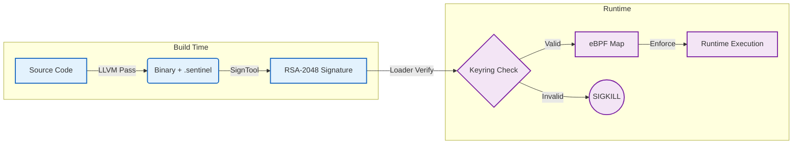

# Sentinel-CC: Policy-Carrying Code

**Current Status:** Phase 2 Complete (ASLR + Deep CFI)

Sentinel-CC eliminates the semantic gap between "what the compiler sees" and "what the kernel executes." Instead of relying on external policy files (which can be tampered with), Sentinel embeds the security policy **directly into the binary** during compilation.

## The Trust Chain Architecture

The system establishes a continuous cryptographic chain of trust from source code to runtime execution.



## Phase 1: The "Intention Extractor" (LLVM)

We implemented a custom **LLVM Pass** (`SentinelPass.cpp`) that analyzes the Control Flow Graph (CFG) to identify every valid system call site.

### Mechanism: Basic Block Splitting

To ensure precision, the pass splits the Basic Block exactly at the syscall instruction. This allows us to record the **exact `RIP` (Instruction Pointer)** where the syscall is allowed to happen.

```cpp
// src/compiler/SentinelPass.cpp
// Split: NewBB starts EXACTLY at 'I' (the syscall instruction)
BasicBlock *NewBB = OldBB->splitBasicBlock(I, "sentinel_site");

// Create Entry: { BlockAddress(NewBB), FuncAddress, 0 }
Constant *SiteLabel = BlockAddress::get(NewBB);
Constant *Entry = ConstantStruct::get(PolicyEntryTy, {SiteLabel, FuncPtr, Size});

```

These entries are written to a custom ELF section named `.sentinel`, which is then signed by the `sign_tool`.

## Phase 2: Runtime Enforcement (eBPF)

The kernel agent (`sentinel.bpf.c`) enforces these rules. Phase 2 introduces support for **ASLR** (Address Space Layout Randomization) and **Deep CFI** (Control Flow Integrity).

### 1. Handling ASLR with "Map-of-Maps"

Since addresses change every run, we cannot use static IPs.

* **Loader:** Parses `/proc/PID/maps` to find the dynamic base address.
* **eBPF:** Uses an **LPM Trie** (Longest Prefix Match) to resolve the `RIP` to a specific library module (e.g., `libc.so` vs `main`).

```c
// src/kernel/sentinel.bpf.c
struct {
  __uint(type, BPF_MAP_TYPE_LPM_TRIE);
  __uint(max_entries, 256);
  __type(key, struct vma_key);
  __type(value, struct vma_value);
} vma_map SEC(".maps");

```

### 2. Deep CFI (Call-Stack Validation)

An attacker might try to jump to a valid syscall instruction from a malicious location (ROP Attack). Sentinel-CC Phase 2 validates the **Caller's Address** by walking the stack.

```c
// src/kernel/sentinel.bpf.c
// Walk the stack to find the caller
u64 stack[4]; 
long ret = bpf_get_stack(ctx, stack, sizeof(stack), BPF_F_USER_STACK);

if (caller_offset >= range->start && caller_offset <= range->end) {
    return 0; // ALLOW
} else {
    bpf_send_signal(9); // KILL: ROP Detected
}

```

## Usage

```bash
# 1. Build the trusted toolchain
make

# 2. Add the signing key to the Kernel Keyring
keyctl add user sentinel:pubkey "$(cat pub.pem)" @u

# 3. Run the protected binary
sudo ./loader ./victim_cfi