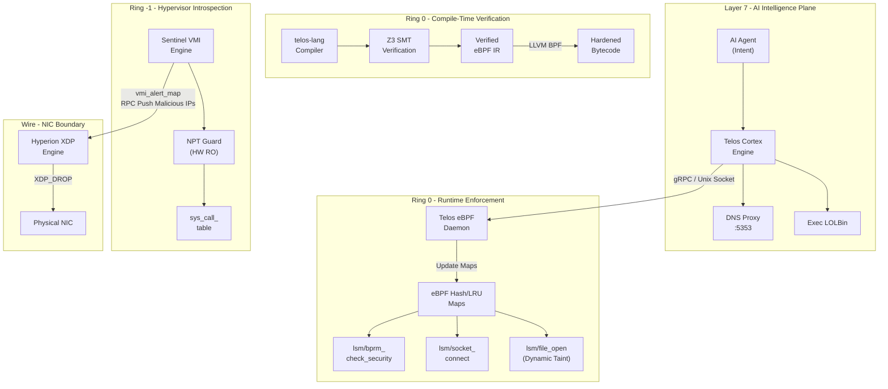

The following diagram maps the complete enforcement topology of the Sentinel Stack, showing signal flow from Layer 7 AI intelligence down to wire-speed NIC drops.

---

## Architecture Topology

---

## Signal Propagation Paths

| Source | Destination | Transport | Signal |
|:-------|:-----------|:----------|:-------|
| Telos Cortex | Telos eBPF Daemon | gRPC / Unix Socket | Intent declarations, policy updates |
| Telos Cortex | Hyperion XDP | HTTP RPC (:9095/block) | Malicious IP blacklist |
| Sentinel VMI | Telos Runtime | vmi_alert_map (eBPF) | Compromised PID + threat level |
| Sentinel VMI | Hyperion XDP | vmi_alert_map (eBPF) | PID for wire-speed isolation |
| telos-lang | Telos eBPF Daemon | LLVM BPF bytecode | Verified kernel sandbox |
| sentinel-kv | Load-Time Checker | Z3 Proof artifacts | Memory safety proofs |
