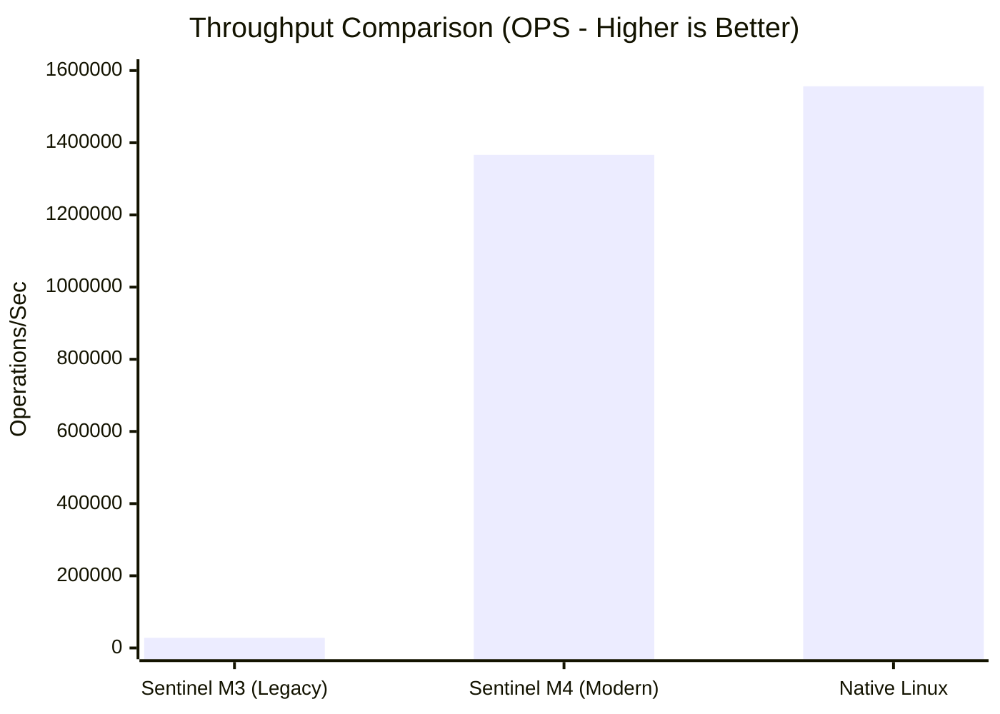

We benchmarked the modern **Sentinel M4/M8 (Seccomp/LSM)** architecture against the legacy **M3 (Ptrace)** prototype and a Native Linux baseline.

## Methodology

* **Architecture:** Sentinel M4 (Seccomp User Notification) vs. Legacy M3 (Ptrace).
* **Workload:** High-frequency syscall stress test (1M+ ops).
* **Metric:** Operations Per Second (OPS) and Relative Overhead.

## Results: The "Architectural Pivot"

Moving from Ptrace to Seccomp/LSM resulted in a **48x increase in throughput**.

| Metric | Native Linux | Sentinel M4 (Modern) | Sentinel M3 (Legacy) |
| :--- | :--- | :--- | :--- |
| **Throughput** | 1,556,510 OPS | **1,366,558 OPS** | ~28,000 OPS |
| **Overhead** | 0% | **~12%** | ~5400% |
| **Latency Cost** | 0.13s | **2.31s** | >10.0s |

### Visualization

## Analysis

### 1. The Cost of Context Switching

The legacy M3 engine (Ptrace) paused the CPU for every syscall to switch contexts (Kernel  User). This crushed throughput to just **28k OPS**.

### 2. The Seccomp Advantage

The modern engine filters events inside the kernel. Only "Critical" events trigger a notification. This allows Sentinel to retain **~88% of native throughput**, making it viable for production workloads.

> **Verdict:** The architectural shift to Kernel-Native enforcement (Seccomp/LSM) successfully bridged the gap between "Research Prototype" and "Production Engine."