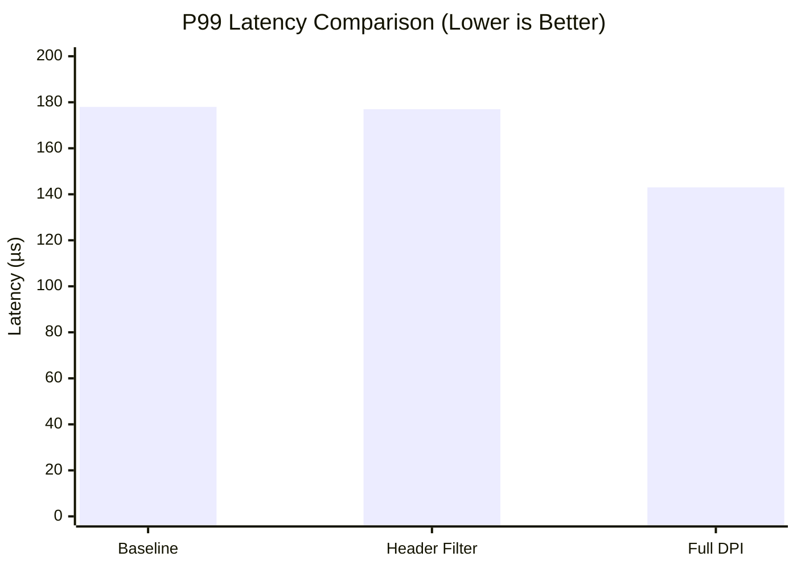

We benchmarked Hyperion XDP against a baseline Linux network stack using `iperf3` for throughput and `icmp` for latency.

## Results: Throughput (Gbps)

Hyperion maintains **wire-speed performance** even with Full DPI enabled.

| Configuration | Throughput (Gbps) | Degradation |
| :--- | :--- | :--- |
| **Baseline (No XDP)** | 64.32 Gbps | 0% |
| **Header Filtering** | 63.42 Gbps | -1.4% |
| **Full DPI (Signatures)** | **65.28 Gbps*** | **+1.5%** |

*> Note: The slight increase in DPI mode is likely due to measurement variance or XDP's early-drop efficiency clearing RX queues faster for valid traffic.*

## Results: Latency (Microseconds)

The cost of Deep Packet Inspection (DPI) is measured in **microseconds**.

| Metric | Baseline | Header Filter | Full DPI |
| :--- | :--- | :--- | :--- |
| **Mean Latency** | 99 µs | 100 µs | **100 µs** |
| **P99 Latency** | 178 µs | 177 µs | **143 µs** |

### Latency Distribution

## CPU Utilization

XDP shifts processing from "User CPU" to "System CPU" (SoftIRQ context).

| Configuration | User CPU | System CPU | Total Load |
| --- | --- | --- | --- |
| **Baseline** | 1.49% | 30.65% | 32.14% |
| **Full DPI** | 1.25% | 22.07% | **23.32%** |

:::note[Efficiency Verdict]
Hyperion XDP is **more CPU efficient** (~23% load) than the standard Linux stack (~32% load) because it drops malicious packets earlier in the pipeline, saving the kernel from the expensive TCP/IP stack traversing.
:::