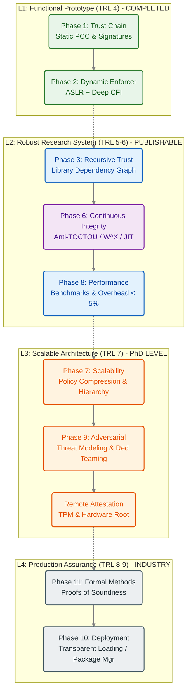

This document outlines the trajectory of **Sentinel-CC** from its current state as a functional research prototype to a production-grade kernel security architecture.

## The Sentinel-CC Maturity Model

We classify the system's evolution into four distinct Levels of Assurance (L1–L4).

---

## Roadmap Analysis

### L1: Functional Prototype (Current Status)

* **Status:** Complete.
* **Capabilities:** Enforces static policy, handles ASLR (Map-of-Maps), validates Call Stacks (CFI).
* **Limitations:** Vulnerable to dynamic code injection (TOCTOU) and assumes a static `libc` layout.

### L2: The "Publication" Tier (Next Priority)

To elevate Sentinel-CC to a Tier-1 research artifact (e.g., Usenix Security), the following gaps must be closed:

* **Phase 6: Continuous Runtime Integrity (Critical)**
* **Problem:** An attacker can use `mmap(PROT_EXEC)` or `dlopen` after the initial verification to inject malicious code.
* **Solution:** Hook `mmap` and `mprotect` to enforce **W^X** (Write XOR Execute) and block anonymous executable mappings.

* **Phase 8: Performance Validation**
* **Goal:** Prove that the overhead is **< 5%** compared to native execution using standard benchmarks (`stress-ng`).

### L3: The High Tier (Long Term)

* **Phase 7: Scalability:** Handling massive applications (e.g., Chrome) by implementing hierarchical, function-level policies instead of instruction-level offsets.
* **Remote Attestation:** Integrating with **Project Telos** to provide a TPM-signed cryptographic "Quote" proving the kernel agent is active and untampered.

---

## Execution Plan (6-Month Sprint)

The immediate research focus is the **L2 Sprint**:

1. **Attack Simulation:** Develop a "Jailbreak" artifact that utilizes `mmap` shellcode injection to demonstrate the L1 limitation.
2. **Hardening (Phase 6):** Implement the BPF `mmap` hook to neutralize the jailbreak.
3. **Measurement (Phase 8):** Generate the comprehensive performance whitepaper.
